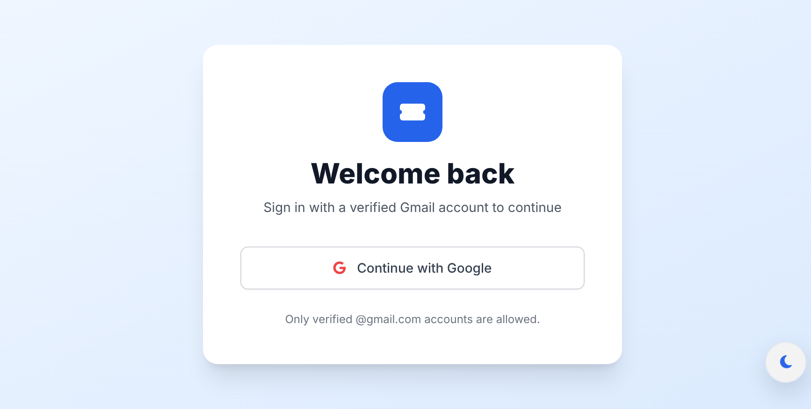
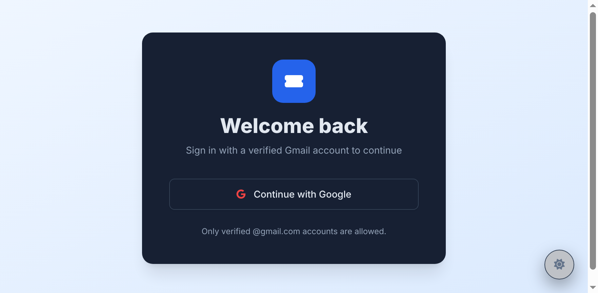

# EventBooking

EventBooking is a browser-based ticket management system for discovering events, booking tickets, processing payments, and viewing digital ticket confirmations.

## Current Experience

- Firebase Google Authentication
- Access restricted to verified Google accounts
- User and admin navigation flows
- Event discovery, filtering, and detail views
- Card, PayPal, and M-Pesa payment flows
- M-Pesa recipient confirmation for `0769323786`
- Ticket IDs, QR-ready codes, booking records, and confirmation pages
- Native lazy loading for repeated event images
- Persistent light/dark mode
- Direct route changes with reduced-motion support
- Firebase Cloud Functions for welcome and purchase confirmation emails

## Screenshots

The live website was reviewed at `http://127.0.0.1:5500/home.html` in both themes. The authentication screen uses a single **Continue with Google** action and accepts verified Google accounts. The theme control is available in the lower-right corner.

### Light Theme



### Dark Theme



To capture updated screenshots locally, open the site with Live Server and use the browser screenshot tool on the login, dashboard, events, payment, and ticket confirmation views.

## Project Structure

```text
.
├── home.html                 Main application shell
├── index.html                Hosting entry point
├── css/styles.css            Theme, motion, and shared styling
├── js/components.js          Rendered application views
├── js/ui.js                  UI actions and payment orchestration
├── js/router.js              Client-side route navigation
├── js/auth.js                Firebase Google authentication
├── js/firebase.js            Firebase browser bootstrap
├── functions/src/index.ts    Email Cloud Functions
├── firebase.json             Firebase deployment configuration
└── functions/.env.example    Email provider configuration template
```

## Run Locally

1. Install the root dependencies if needed.
2. Open the project root with VS Code Live Server.
3. Visit `http://127.0.0.1:5500/`.
4. Add `127.0.0.1` and `localhost` to Firebase Authentication authorized domains.
5. Enable Google under Firebase Authentication sign-in providers.

## Payment and Email Configuration

Purchase and welcome emails are sent by Cloud Functions through Resend. Copy `functions/.env.example` to `functions/.env` and set a Resend API key and verified sender address. The `.env` file is ignored by Git.

PayPal requires `PAYPAL_CLIENT_ID`, `PAYPAL_CLIENT_SECRET`, `PAYPAL_BASE_URL`, and `PAYPAL_CURRENCY`. M-Pesa requires Daraja credentials, a shortcode, and a public `MPESA_CALLBACK_URL`. Deploy the callable functions and implement the provider approval/callback flow before issuing tickets in production. The browser no longer simulates either payment or marks an STK push as paid.

## Hosting and domain

`firebase.json` is configured for Firebase Hosting. Deploy with `firebase deploy --only hosting,functions`, then add your owned domain in Firebase Console under Hosting > Add custom domain and publish the DNS records Firebase provides. A domain cannot be assigned from source code without a domain name and DNS access.

```env
RESEND_API_KEY=your_resend_api_key
EMAIL_FROM=EventBooking <noreply@your-verified-domain.com>
```

Build and deploy the Functions with:

```bash
cd functions
npm run build
cd ..
firebase deploy --only functions
```

Cloud Functions deployment requires the Firebase Blaze plan. The browser can still be developed locally without deploying email functions, but email delivery will remain inactive until the Functions are deployed and the provider is configured.

## Validation

- Browser JavaScript syntax checks pass with `node --check`.
- Firebase Functions TypeScript build passes with `npm run build` from `functions/`.
- Dark mode and theme persistence were tested in the running browser.
- Google redirect initiation was tested; successful login requires the Firebase provider and authorized domains to be configured.

## Presentation

Open [presentation.html](presentation.html) in a browser for the project preparation slides. Use the arrow buttons or keyboard arrow keys to move between slides.
